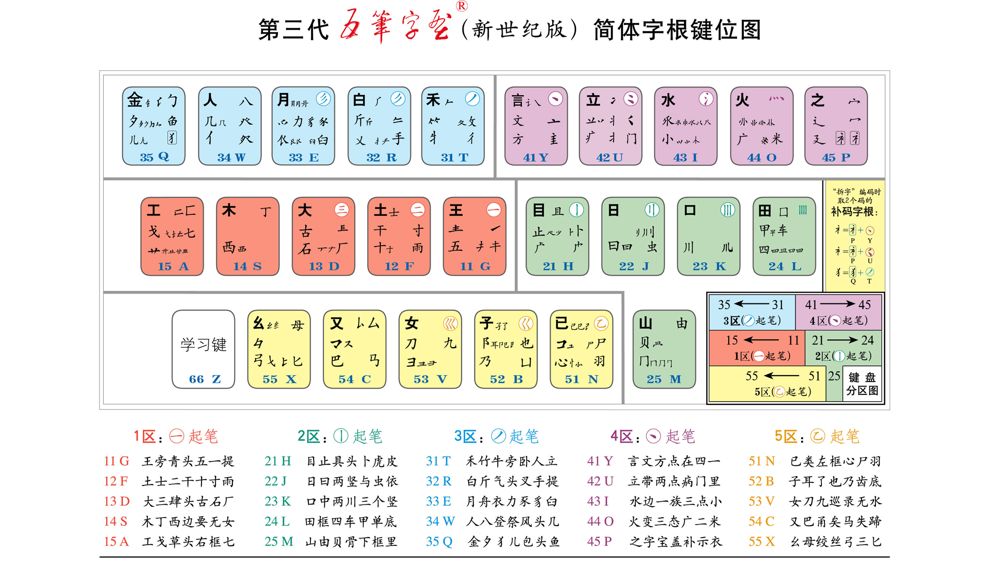

# 新世纪五笔字根图-v1.1

项目最终显示效果如下：

大一统2012字根图。

网页版查看之前应先安装字体“word_root_sources/wmwb06-font/wmwb06.ttf”，再打开网页“word_root_sources/wmwb06-font/wmwb06.html”观看。

## TODOs

### 1.图片处理

word_root_sources/images-saved/ 目录下所有图片

  * 去背景转png格式
  * 按键盘分区合并多个字根图为一张图片

### 2.字根显示位置补全

基于 word_root_sources/xinshiji.jpg 图片

  * 补全 src/hooks/useKeysOne.ts 等文件中字根坐标位置（x, y）

### 3.字根位置对应关系

根据第一步中处理好的图片

  * 将具体字根位置显示坐标，补全到 useKeysOne.ts 配置文件中

### 4.完成字根组件

根据 useKeysOne 等配置文件数据显示字根到对应组件（components/SectionOne）

## 版权说明

word_root_sources 包为熊怀东制作，可用于教育目的，不可用于商业目的，若有需要，可与他本人联系。

代码部分遵循[MIT](https://tldrlegal.com/license/mit-license)。

